# Trunk-Based Development & Deployment Guide

## 🚀 Overview

Your CI/CD pipeline is now configured for **trunk-based development**:
- All changes go directly to the `main` branch
- Tests run automatically on every push
- If tests pass, changes are automatically deployed to production
- No staging environment needed - fast, simple deployments

## 🔐 Required Setup

### 1. GitHub Secrets
Go to your GitHub repository → Settings → Secrets and variables → Actions:

```
OPENAI_API_KEY=your_openai_api_key_here
RAILWAY_TOKEN=your_railway_token_here
PRODUCTION_URL=https://your-app.railway.app
```

### 2. Get Railway Token
```bash
# Install Railway CLI
npm install -g @railway/cli

# Login and get token
railway login
railway auth
```

### 3. Railway Setup
- Connect your GitHub repo to Railway
- Set branch to `main`
- Add environment variables:
  ```
  OPENAI_API_KEY=your_key
  FLASK_ENV=production
  ```

## 🔄 Development Workflow

### Simple Trunk-Based Flow:

1. **Make changes directly on main**:
   ```bash
   git checkout main
   git pull origin main
   # Make your changes
   git add .
   git commit -m "feat: add new feature"
   git push origin main
   ```

2. **CI/CD automatically**:
   - ✅ Runs all tests
   - ✅ Builds Docker image
   - ✅ Deploys to production (if tests pass)
   - ✅ Runs smoke tests
   - ✅ Monitors performance

3. **For larger changes, use short-lived feature branches**:
   ```bash
   git checkout -b feature/quick-fix
   # Make changes
   git push origin feature/quick-fix
   # Create PR to main
   # Merge immediately after review
   ```

## 🧪 Quality Gates

Your deployment will only succeed if:
- ✅ All unit tests pass
- ✅ All integration tests pass  
- ✅ Security scan passes
- ✅ Docker build succeeds
- ✅ Application starts successfully

## 📊 What Happens on Each Push

```mermaid
graph TD
    A[Push to main] --> B[Run Tests]
    B --> C{Tests Pass?}
    C -->|Yes| D[Security Scan]
    C -->|No| E[❌ Block Deployment]
    D --> F[Build Docker]
    F --> G[Deploy to Production]
    G --> H[Smoke Tests]
    H --> I[✅ Live in Production]
```



## 🚨 Rollback Strategy

If something goes wrong:

```bash
# Quick rollback to previous commit
git revert HEAD
git push origin main

# Or rollback to specific commit
git revert <commit-hash>
git push origin main
```

## 🔧 Local Testing

Always test locally before pushing:

```bash
# Run all tests
./run_tests_docker.sh --all

# Verify tests pass
echo $?  # Should be 0

# Then push
git push origin main
```

## 📈 Monitoring

After deployment, monitor:
- GitHub Actions for CI/CD status
- Railway logs for application health
- Test results artifacts for performance metrics

## 🎯 Best Practices

1. **Keep changes small** - easier to test and rollback
2. **Test locally first** - catch issues before CI/CD
3. **Use feature flags** - for gradual rollouts
4. **Monitor after deployment** - watch for issues
5. **Commit frequently** - smaller, safer changes

## 🔗 Quick Commands

```bash
# Test everything locally
./run_tests_docker.sh --all

# Deploy to production
git push origin main

# Check deployment status
# Go to GitHub → Actions tab

# Check production health
curl https://your-app.railway.app/health
```

## ✅ You're Ready!

Your trunk-based CI/CD pipeline is now configured. Simply:

1. Set up the GitHub secrets
2. Connect Railway to your repo
3. Push to main
4. Watch your app deploy automatically! 🚀
